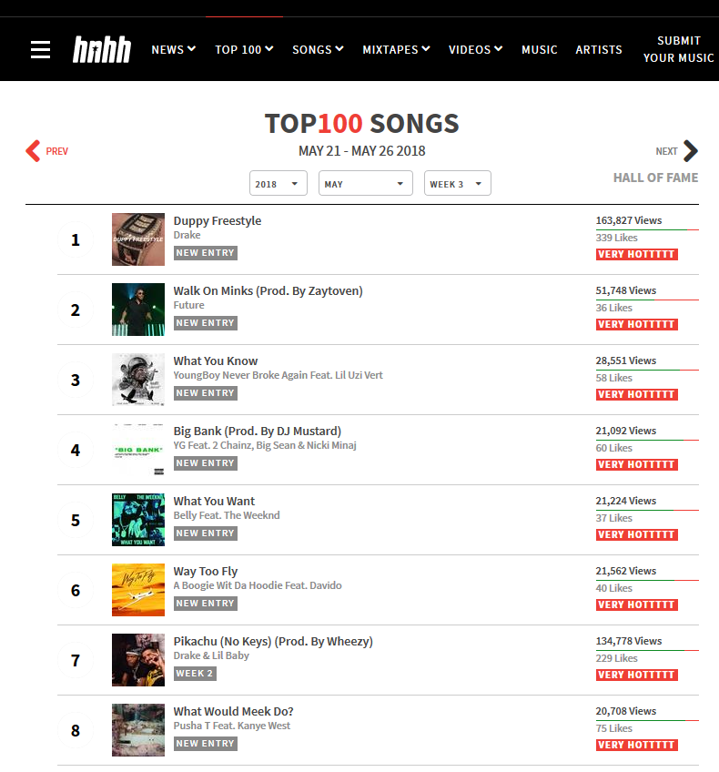
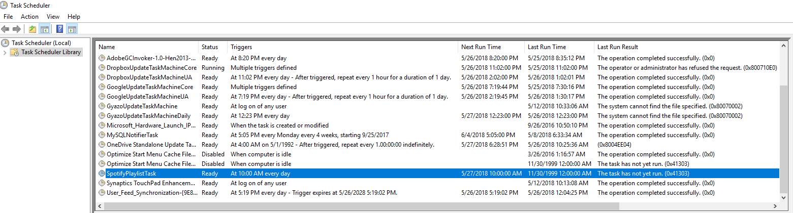
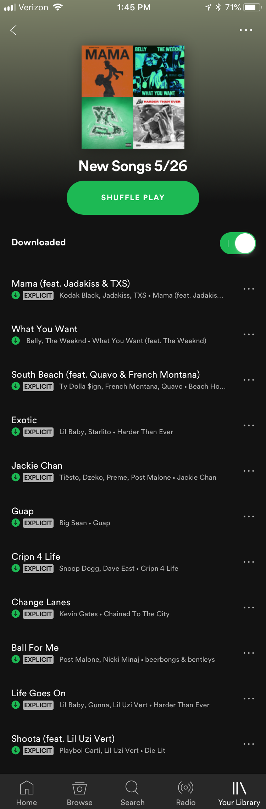

Shoutout to __MyBridge__ for listing this project as one of the [Top 10 Python Open Source Projects of June 2018](https://medium.mybridge.co/python-open-source-of-the-month-v-june-2018-5396a661b110)!

# Spotify Playlist Generator

Spotify Playlist Generator is a Python script that automatically builds a new Spotify playlist each week with new music.  This script was written for personal use, so the playlist creation is authorized by an access token retreived for my Spotify account.  I used [Windows Task Scheduler](https://en.wikipedia.org/wiki/Windows_Task_Scheduler) to regulate the script to run every morning at 10:00 AM on my computer.

### How it works
1. The most recently acquired [Spotify __access token__](https://beta.developer.spotify.com/documentation/general/guides/authorization-guide/), the script's Spotify __refresh token__, and a Base64-encoded string containing my "app's" client ID and secret are stored in a local SQLite table called *tokens* (I've excluded this database from the repository because these tokens provide read and write access to my Spotify account).
2. When the script starts, it first checks the authority of its current __access token__.  Since this token expires after one hour, a new one will usually have to be generated.  The script uses its __refresh token__, which never changes, to acquire a new __access token__ from Spotify's token service.
3. Now that it has a valid access token, it proceeds to scrape the current top 100 songs from HotNewHipHop, located at this URL: https://www.hotnewhiphop.com/top100/

4. It parses through the page with the [Beautiful Soup 4](https://www.crummy.com/software/BeautifulSoup/bs4/doc/) library, building a list of "song candidates."  A song qualifies as a candidate if its artist list contains at least one artist in a `desiredArtists` list defined at the beginning of the script (a static list of artists who I like). The __binary search__ algorithm is used to check for matches.
5. Then, for each song candidate, it ensures that the candidate is not a duplicate by querying the *songs_added* local db table for a song name and primary artist match.
6. Songs that are not duplicates are searched through Spotify's `/search` endpoint.  The Spotify `song ids` that are found (since these songs are new, many aren't on Spotify yet) are accumulated into a list.
7. Now that the script has a list of song ids to add, it must determine whether to create a new playlist or add to the most recently created (or *current*) playlist.  New playlist are created on __Saturday__.  If it's a Saturday, the script uses the access token retrieved earlier to make a POST request to create a new playlist on my account, named *New Songs {date}*.  Otherwise, it queries the local *playlists_created* table for the Spotify `playlist id` of the most recently created playlist.
8. It then uses the `playlist id` and `song ids` to make a POST request to a Spotify endpoint that adds each song to the playlist, entering these songs into the *songs_added* local db table in the process.

### Scheduling
This task is scheduled with Windows Task Scheduler:

### Final Result
